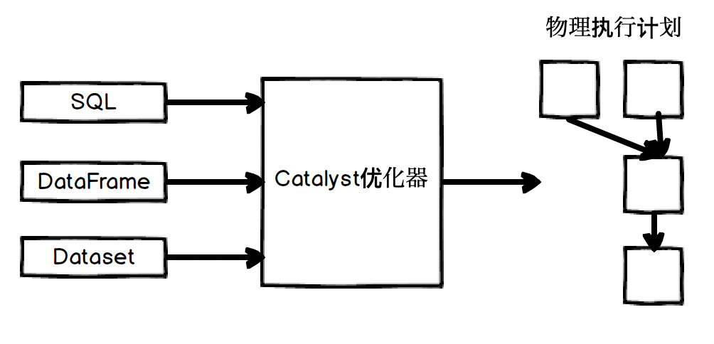
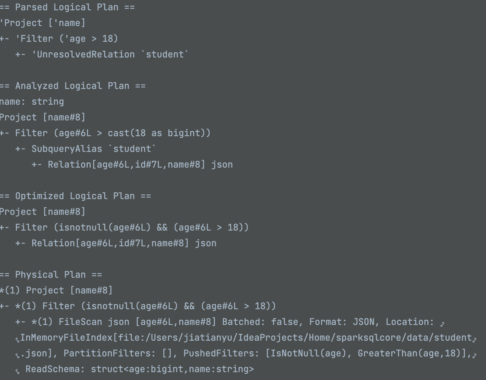
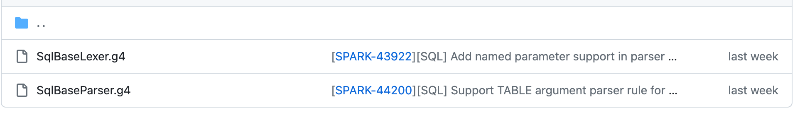

# 第二章 spark基础知识介绍

## 理解RDD

### RDD的概念

定义：RDD是spark的核心数据结构，全称是弹性分布式数据集，本质是一种分布式的内存抽象，表示一个只读的数据分区集合(Partition)

5大特性：

|       特性名        | 特性类型 |            特性定义             |
| :-----------------: | :------: | :-----------------------------: |
|    dependencies     |   变量   |         刻画了RDD的依赖         |
|       compute       |   方法   |    刻画了生成该RDD的计算规则    |
|     partitions      |   变量   | 刻画了集群中该RDD所有的数据分片 |
|     partitioner     |   方法   |     切分数据集的规则或方法      |
| preferred locations |   变量   |   刻画了数据分片物理位置偏好    |

### RDD核心抽象


# 第三章 Spark Sql执行全过程概述

## 从SQL到RDD：一个简单的案例

- 本节主要是通过一段简单的sql来概述spark的执行过程

### 结构化API执行概述

- 整个过程是：将编写的代码以spark作业的形式进行提交，然后代码交由Catalyst优化器决定执行逻辑，并制定执行计划，最后代码运行并将结果返回给用户

  

### 执行过程概述

- sql执行全过程概述

  - Unresolved LogicalPlan:未解析的逻辑算子树，这里只是数据结构，不包含数据信息(表的来源等。。)

  - Analyzed LogicalPlan: 解析后的逻辑算子树，节点中绑定各种数据信息

  - Optimized LogicalPlan: 优化后的逻辑算子树，使用优化规则对低效的逻辑计划进行转换

  - 在逻辑计划后的物理计划可能有多个，最终需要通过代价模型(策略)选择最优的物理计划

  - 在Prepared SparkPlan这里确保分区操作正确，generatecode等操作

  - 最后action算子触发job

    

- 实际转换过程

  

  

### 测试代码查看执行过程

- 一段代码：

  ```scala
  val spark = SparkSession.
    builder().
    appName("example").
    master("local").
    config("spark.driver.bindAddress", "127.0.0.1").
    getOrCreate()
  
  spark.sparkContext.setLogLevel("DEBUG")
  
  spark.read.json("/Users/jiatianyu/IdeaProjects/Home/sparksqlcore/data/student.json")
    .createTempView("student")
  
  val frame = spark.sql("select name from student where age > 18")
  frame.show()
  ```

- debug查看执行计划：

  

## 几个重要的概念

- 比较抽象，后续需要加深下理解

- InternalRow

  - 对于关系表，通常操作的数据都是以行为单位的，包括插入数据其实也是迭代按行插入

  - 代码最终的执行是对RDD(产生和转换)的一系列操作，RDD的类型为:RDD[InteralRow]

    

- TreeNode体系

  - TreeNode是一种数据结构，是SparkSQL中所有树结构的基类

    

- Expression体系

  - 表达式一般指的是不需要触发执行引擎而能够直接进行计算的单元

    

# 第四章 Spark SQL编译器 Parser

## 前言

本章主要解决：SparkSQL是如何被编译的

借鉴的博客地址：
- https://blog.csdn.net/qq_35128600/category_11920835.html
- https://www.jianshu.com/p/1910b2022600

## ANTLR

### 概念

ANTLR是一种语法生成工具，能够自动构建语法分析树，同时还支持监听器和访问者模式的树遍历器。sparksql的有多后端实现正是基于访问者模式的，可以将对象机构和算法(解析与应用代码)分离

### 访问者模式

#### 概念和基本思想

- 访问者模式，是行为型设计模式之一，是一种将数据操作与数据结构分离的设计模式。
- 访问者模式的基本思想是：软件系统中拥有一个由许多对象构成的，比较稳定的对象结构，这些对象结构都拥有一个accept方法来实现接受访问者对象；访问者(很多的访问者)是一个借口，拥有visit方法(每个对象结构都有一个)，这个方法对访问到的对象结构中不同类型的元素做出不同的反应；在对象结构的访问过程中，遍历整个对象结构，对每个元素都实施accept方法，在每个元素的accept方法中回调访问者的visit方法，从而使访问者得以处理对象的每个元素。

#### 实例

- 以上面博客地址为例：首先构建一个账本对象，元素有两个即收入和支出；访问者也就是看账本的人有boss和会计，则每个人对待账本对象的元素的目的和行为是不一样的，对应不同的visit方法

  

#### 静态分派及动态分派(附)

- 根据对象的类型，而对方法进行选择就是分派，静态分派发生在编译时期，而动态分派需要在实际运行时才能去确定

- 静态分派：方法的重载就是经典的静态分派

  ```java
  public class StaticDispatch {
      public void method(String s){
          System.out.println("输入类型是String");
      }
  
      public void method(Integer i){
          System.out.println("输入类型是Integer");
      }
  
      public static void main(String[] args) {
          StaticDispatch dispatch = new StaticDispatch();
          dispatch.method("124");
          dispatch.method(124);
      }
  }
  ```

- 动态分派：主要是多态，即方法的重写

  ```java
  interface Person{
      void method();
  }
  
  class Worker implements Person{
      @Override
      public void method() {
          System.out.println("I am as worker");
      }
  }
  class Teacher implements Person{
      @Override
      public void method() {
          System.out.println("I am teacher!");
      }
  }
  
  public class DynamicDispatch {
      public static void main(String[] args) {
          Person worker = new Worker();
          Person teacher = new Teacher();
          worker.method();
          teacher.method();
      }
  }
  ```

### ANTLR的使用示例

#### 简单的demo1

- 在idea中安装**ANTLR V4插件**

  

- 新建一个antlr4语法文件 -> Mesql.g4

  ```
  // 语法文件通常以 granmar 关键宇开头 这是一个名为 MeSql 的语法 它必须和文件名 MeSql.g4相匹配
  grammar MeSql;
  
  // 定义一条名为 me 的语法规则，它匹配一对花括号[START, STOP为词法关键词]、逗号分隔的 value [另一条语法规则，在下面], 以及 * 匹配多个 value
  me : START value (',' value)* STOP ;
  
  // 定义一条value的语法规则，正是上面me语法中的value，该value的值应该是 INT 或者继续是 me [代表嵌套], | 符号代表或
  value : me
        |INT
        ;
  
  // 以下所有词法符号都是根据正则表达式判断
  // 定义一个INT的词法符号, 只能是正整数
  INT : [0-9]+ ;
  
  // 定义一个START的词法符号, 只包含{
  START : '{' ;
  
  // 定义一个STOP的词法符号, 只包含}
  STOP : '}' ;
  
  // 定义一个AND的词法符号, 只包含,
  AND : ',' ;
  
  // 定义一个WS的词法符号，后面跟正则表达式，意思是空白符号丢弃
  WS  : [\t\n\r]+ -> skip ;
  ```

- 右键选中Test Rule me

  

- 在弹出的ANTLR Preview中，输入测试数据，得到AST语法树：

  

#### 简单的demo2

- 语法文件：四则运算

  ```
  grammar Calculator;
  
  line : expr EOF ;
  expr : '(' expr ')'             # parentExpr
       | expr ('*'|'/') expr      # multOrDiv
       | expr ('+'|'-') expr      # addOrSubtract
       | FLOAT                    # float;
  
  WS : [ \t\n\r]+ -> skip;
  FLOAT : DIGIT+ '.' DIGIT* EXPONENT?
        | '.' DIGIT+ EXPONENT?
        | DIGIT+ EXPONENT?;
  fragment DIGIT : '0'..'9';
  fragment EXPONENT : ('e'|'E') ('+'|'-')? DIGIT+ ;
  ```

- AST抽象语法树：

  

#### demo-文件分层

- 通常会将上面的文件，拆分为语法文件和词法文件，同时语法文件中通过关键字指向词法文件

- 语法文件：MeSqlParser.g4

  ```
  // 语法文件通常以 grammar 关键宇开头 这是一个名为 MeSql 的语法 它必须和文件名 MeSql.g4相匹配
  parser grammar MeSqlParser;
  
  options {
      // 表示解析token的词法解析器使用SearchLexer
      tokenVocab = MeSqlLexer;
  }
  
  // 定义一条名为 me 的语法规则，它匹配一对花括号[START, STOP为词法关键词]、逗号分隔的 value [另一条语法规则，在下面], 以及 * 匹配多个 value
  me : START value (',' value)* STOP ;
  
  // 定义一条value的语法规则，正是上面me语法中的value，该value的值应该是 INT 或者继续是 me [代表嵌套], | 符号代表或
  value : me
        |INT
        ;
  ```

- 词法文件：MeSqlExer.g4

  ```
  // 语法文件通常以 granmar 关键宇开头 这是一个名为 MeSql 的语法 它必须和文件名 MeSql.g4相匹配
  lexer grammar MeSqlLexer;
  
  // 以下所有词法符号都是根据正则表达式判断
  // 定义一个INT的词法符号, 只能是正整数
  INT : [0-9]+ ;
  
  // 定义一个START的词法符号, 只包含{
  START : '{' ;
  
  // 定义一个STOP的词法符号, 只包含}
  STOP : '}' ;
  
  // 定义一个AND的词法符号, 只包含,
  AND : ',' ;
  
  // 定义一个WS的词法符号，后面跟正则表达式，意思是空白符号丢弃
  WS  : [\t\n\r]+ -> skip ;
  
  ```

- 需要注意的是，语法文件可能会标红，显示没有token文件


- 如果出现上述问题，则需要生成tokens文件，右键词法文件，选择Configure ANTLR

  

- 然后配置生成路径：

  

- 配置完成后，再次右键词法文件，然后选择Genarate ANTLR Recognizer,就会生成tokens文件，最后将tokens文件放到跟语法文件在同一目录即可

  

- 最后右键语法文件中的me，右键选择Test Rule me，就可以弹出ANTLR Preview

#### 编译语法文件

- 通过插件，输入数据就可以得到其对应的抽象语法树(只是看着方便，计算机无法识别)，而实际上我们真正需要的是一个具有树结构的java类，因此需要对语法文件进行编译

- 编译的步骤跟上面的类似，只不过是对语法文件，右键先配置Configure ANTLR，然后再Genarate ANTLR Recognizer，得到了一车的文件(词法分析器，语法分析器及访问者类)：

  

- 新建Test类，通过debug即可得到树结构

  ```java
  public class Test {
      public static void main(String[] args) {
          ANTLRInputStream input = new ANTLRInputStream("{1,2,{3,4}");
          //词法解析器，处理input
          MeSqlLexer lexer = new MeSqlLexer(input);
          //词法符号的缓冲器，存储词法分析器生成的词法符号
          CommonTokenStream tokens = new CommonTokenStream(lexer);
          //语法分析器，处理词法符号缓冲区的内容
          MeSqlParser parser = new MeSqlParser(tokens);
          ParseTree tree = parser.me();
          System.out.println(tree.toStringTree(parser));
      }
  }
  ```

  小翠在此：

  

#### CustomRule

- 上面已经得到了输入字符串的语法树，现在可以通自定义计算规则(求和)然后遍历语法树，进行逻辑计算；通过查看Antlr编译生成的java类可以看到，其提供了方式(两个接口)：listener和visitor

  

##### Listener

- 在监听器模式下，用户不需要自己实现对语法树的递归(通过ParseTreeWalker类,深度优先遍历)，只需要自己实现逻辑代码

- 对于me规则，通过enterMe()进入子节点，在遍历完所有子节点后通过exitMe()退出；value就对应的是,enterValue()和exitValue()进

  入和退出。也就是说每条语法规则都有一个enter方法和exit方法

- Antlr自动生成的实现类，只要填充方法即可(对节点数据求和)：

  ```java
  /**
   * This class provides an empty implementation of {@link MeSqlParserListener},
   * which can be extended to create a listener which only needs to handle a subset
   * of the available methods.
   */
  public class MeSqlParserBaseListener implements MeSqlParserListener {
  
  	Map<String, Integer> map = new HashMap<>();
  
  	/**
  	 * {@inheritDoc}
  	 *
  	 * <p>The default implementation does nothing.</p>
  	 */
  	@Override public void enterMe(MeSqlParser.MeContext ctx) {
  		if (!map.containsKey(ctx.getText())) {
  			map.put(ctx.getText(), 0);
  		}
  	}
  	/**
  	 * {@inheritDoc}
  	 *
  	 * <p>The default implementation does nothing.</p>
  	 */
  	@Override public void exitMe(MeSqlParser.MeContext ctx) {
  		if (ctx.parent == null) {
  			int sum = map.values().stream().mapToInt(i -> i).sum();
  			System.out.println(" result = " + sum);
  		}
  	}
  	/**
  	 * {@inheritDoc}
  	 *
  	 * <p>The default implementation does nothing.</p>
  	 */
  	@Override public void enterValue(MeSqlParser.ValueContext ctx) {
  		if (ctx.INT() != null && map.containsKey(ctx.parent.getText())) {
  			map.put(ctx.parent.getText(), map.get(ctx.parent.getText()) + Integer.parseInt(ctx.INT().getText()));
  		}
  	}
  	/**
  	 * {@inheritDoc}
  	 *
  	 * <p>The default implementation does nothing.</p>
  	 */
  	@Override public void exitValue(MeSqlParser.ValueContext ctx) { }
  
  	/**
  	 * {@inheritDoc}
  	 *
  	 * <p>The default implementation does nothing.</p>
  	 */
  	@Override public void enterEveryRule(ParserRuleContext ctx) { }
  	/**
  	 * {@inheritDoc}
  	 *
  	 * <p>The default implementation does nothing.</p>
  	 */
  	@Override public void exitEveryRule(ParserRuleContext ctx) { }
  	/**
  	 * {@inheritDoc}
  	 *
  	 * <p>The default implementation does nothing.</p>
  	 */
  	@Override public void visitTerminal(TerminalNode node) { }
  	/**
  	 * {@inheritDoc}
  	 *
  	 * <p>The default implementation does nothing.</p>
  	 */
  	@Override public void visitErrorNode(ErrorNode node) { }
  }
  ```

- Listener模式的主程序：

  ```java
  public class ListenerTest {
      public static void main(String[] args) {
          CharStream input = CharStreams.fromString("{1,2,{3,4}");
          //词法解析器，处理input
          MeSqlLexer lexer = new MeSqlLexer(input);
          //词法符号的缓冲器，存储词法分析器生成的词法符号
          CommonTokenStream tokens = new CommonTokenStream(lexer);
          //语法分析器，处理词法符号缓冲区的内容
          MeSqlParser parser = new MeSqlParser(tokens);
  
          ParseTree tree = parser.me();
          // ParseTreeWalker类将实现的MeSqlParserBaseListener监听器放入
          new ParseTreeWalker().walk(new MeSqlParserBaseListener(), tree);
      }
  }
  ```

##### Visitor

- 区别于Listener模式每一条语法规则对应两个方法(enter和exist)，Visitor的每条规则有一个visit方法

- 访问者模式也就是sprksql使用的sql语法解析模式，特点是需要用户手动控制语法树节点的调用，比较灵活

- MeSqlParserBaseVisitor：

  ```java
  // Generated from /Users/jiatianyu/IdeaProjects/Home/sparksqlcore/src/main/scala/com/sparksql/learn/chapter4/antlr/demo/MeSqlParser.g4 by ANTLR 4.9.2
  package com.sparksql.learn.chapter4.antlr.demo.gen;
  import org.antlr.v4.runtime.tree.AbstractParseTreeVisitor;
  
  import java.util.List;
  
  /**
   * This class provides an empty implementation of {@link MeSqlParserVisitor},
   * which can be extended to create a visitor which only needs to handle a subset
   * of the available methods.
   *
   * @param <T> The return type of the visit operation. Use {@link Void} for
   * operations with no return type.
   */
  public class MeSqlParserBaseVisitor extends AbstractParseTreeVisitor<Integer> implements MeSqlParserVisitor<Integer> {
  	/**
  	 * {@inheritDoc}
  	 *
  	 * <p>The default implementation returns the result of calling
  	 * {@link #visitChildren} on {@code ctx}.</p>
  	 */
  	// 循环me节点的所有子节点，调用visitValue函数
  	@Override
  	public Integer visitMe(MeSqlParser.MeContext ctx) {
  		final List<MeSqlParser.ValueContext> value = ctx.value();
  		return value.stream().mapToInt(this::visitValue).sum();
  	}
  
  	// visitValue函数中判断如果是me节点则调用visitMe，否则返回INT值
  	@Override
  	public Integer visitValue(MeSqlParser.ValueContext ctx) {
  		if (ctx.me() != null) {
  			return visitMe(ctx.me());
  		}
  		if (ctx.INT() != null) {
  			return Integer.parseInt(ctx.INT().getText());
  		}
  		return 0;
  	}
  }
  ```

- Visitor模式的主程序：

  ```java
  public class VisitorTest {
      public static void main(String[] args) {
          CharStream input = CharStreams.fromString("{1,2,{3,4}");
          //词法解析器，处理input
          MeSqlLexer lexer = new MeSqlLexer(input);
          //词法符号的缓冲器，存储词法分析器生成的词法符号
          CommonTokenStream tokens = new CommonTokenStream(lexer);
          //语法分析器，处理词法符号缓冲区的内容
          MeSqlParser parser = new MeSqlParser(tokens);
  
          // 创建自定义访问器
          MeSqlParserBaseVisitor visitor = new MeSqlParserBaseVisitor();
          // 将parser语法树头节点放入
          Integer sum = visitor.visitMe(parser.me());
          System.out.println(sum);
      }
  }
  ```

- 输出结果也是10

## SparkSqlParser

### Spark中的语法文件

- sparksql也有ANTLR4文件，在：https://github.com/apache/spark/tree/master/sql/catalyst/src/main/antlr4/org/apache/spark/sql/catalyst/parser，看到也是由词法文件和语法文件组成

  

- 使用ANTLR4插件可以测试一条sql的抽象语法树：

  


- spark的sql解析相关实现

  - 核心类是AstBuilder，主要继承由语法文件生成的访问者模式类，用于生成SQL对应的抽象语法树AST(UnresolverLogicalPlan)；SparkSqlParser在AstBuilder的基础上定义了一些DDL语句的访问操作

  - 如果需要开发新的语法支持时，首先需要在语法和词法文件中添加对应的规则，同时重新生成词法分析器、语法分析器和访问者接口和实现类，然后在AstBuilder等类中添加相应的访问逻辑，最后添加执行逻辑

    

  - 直接复制书上的类图，idea画的类图有问题。。标红框的类名错了，应该为：SqlBaseParserBaseVisitor

    

  - SqlBaseParserBaseVisitor：

    

  - AstBuilder：

    

  - SparkSqlParser：

    

### 访问者模式demo

- 对语法和词法编译后，自定义visitor继承BaseVisitor，打印访问路径

- MySparkVisitor：部分代码

  ```java
  public class MySparkVisitor extends SqlBaseParserBaseVisitor<String> {
      public String visitSingleStatement(SqlBaseParser.SingleStatementContext ctx) {
          System.out.println("visitSingleStatement");
          return visitChildren(ctx);
      }
  
      public String visitSingleExpression(SqlBaseParser.SingleExpressionContext ctx) {
          System.out.println("visitSingleExpression");
          return visitChildren(ctx);
      }
  
      public String visitSingleTableIdentifier(SqlBaseParser.SingleTableIdentifierContext ctx) {
          System.out.println("visitSingleTableIdentifier");
          return visitChildren(ctx);
      }
  
  # ......
  }
  ```

- 还需要有一个Driver类驱动上述访问过程：sql语句与上面通过antlr插件生成语法树的sql一致，方便比较

  ```java
  public class VisitorTest {
      public static void main(String[] args) {
          String query = "select name from student where age > 18";
          SqlBaseLexer lexer = new SqlBaseLexer(new ANTLRInputStream(query.toUpperCase()));
          SqlBaseParser parser = new SqlBaseParser(new CommonTokenStream(lexer));
  
          // 创建自定义访问器
          MySparkVisitor visitor = new MySparkVisitor();
          // 将parser语法树头节点放入
          visitor.visitSingleStatement(parser.singleStatement());
      }
  }
  ```

- 打印信息为：可以看到是对语法树的前序遍历

  ```
  visitSingleStatement 根结点
  visitStatementDefault
  visitQuery
  
  visitQueryTermDefault 左子树
  visitQueryPrimaryDefault
  visitNamedExpressionSeq
  visitNamedExpression
  visitExpression
  visitPredicated
  visitValueExpressionDefault
  visitStar
  visitFromClause
  visitRelation
  visitTableName: STUDENT
  visitIdentifier
  visitUnquotedIdentifier
  visitPredicated
  visitComparison
  visitValueExpressionDefault
  visitColumnReference
  visitIdentifier
  visitUnquotedIdentifier
  visitComparisonOperator
  visitValueExpressionDefault
  visitConstantDefault
  visitNumericLiteral
  visitIntegerLiteral
  
  visitQueryOrganization 右子树
  ```

- 附：书上的一段话

  

## 总结

本章主要是讲解了SparkSQL中的编译器，即一段sparksql代码是如何转换为AST的；还给出了spark基于访问者模式的实现类，从AstBuilder中可以看到不仅存在对树的访问逻辑，还存在着执行逻辑——将节点转换为Parsed Logical Plan(UnresolvedRelation)。

# 第五章

## 前言

上一章最后通过自定义的实现类打印了对于AST的访问路径，本章主要解决：在spark中一段sql是如何转换为逻辑计划的，具体的：

- 在spark中的AstBuilder是如何生成AST的(遍历方式)，以及如何进一步的将AST转换Unresolved LogicalPlan(未解析的逻辑算子树)

- Unresolved LogicalPlan -> Analyzed LogicalPlan
- Analyzed LogicalPlan -> Optimized LogicalPlan


# 附

##  SparkSession

### 前言

主要介绍spark是如何构建**SparkSession**及**SessionState**

### SparkSession的构建过程

- 测试代码

  ```java
  val spark = SparkSession.
    builder().
    appName("example").
    master("local").
    config("spark.driver.bindAddress", "127.0.0.1").
    enableHiveSupport().
    getOrCreate()
  
  spark.sparkContext.setLogLevel("DEBUG")
  
  spark.read.json("/Users/jiatianyu/IdeaProjects/Home/sparksqlcore/data/student.json")
    .createTempView("student")
  
  val frame1 = spark.sql("select name from student where age > 18")
  frame1.show()
  ```

- 直接看getOrCreate()函数，贴一下代码。首先(driver端)是从本地的线程中获取活跃的session，有的话就返回，没有就要创建一个新的SparkSession

  ```java
  def getOrCreate(): SparkSession = synchronized {
    val sparkConf = new SparkConf()
    options.foreach { case (k, v) => sparkConf.set(k, v) }
  
    if (!sparkConf.get(EXECUTOR_ALLOW_SPARK_CONTEXT)) {
      assertOnDriver()
    }
  
    // Get the session from current thread's active session.
    var session = activeThreadSession.get()
    if ((session ne null) && !session.sparkContext.isStopped) {
      applyModifiableSettings(session, new java.util.HashMap[String, String](options.asJava))
      return session
    }
  
    // Global synchronization so we will only set the default session once.
    SparkSession.synchronized {
      // If the current thread does not have an active session, get it from the global session.
      session = defaultSession.get()
      if ((session ne null) && !session.sparkContext.isStopped) {
        applyModifiableSettings(session, new java.util.HashMap[String, String](options.asJava))
        return session
      }
  
      // No active nor global default session. Create a new one.
      val sparkContext = userSuppliedContext.getOrElse {
        // set a random app name if not given.
        if (!sparkConf.contains("spark.app.name")) {
          sparkConf.setAppName(java.util.UUID.randomUUID().toString)
        }
  
        SparkContext.getOrCreate(sparkConf)
        // Do not update `SparkConf` for existing `SparkContext`, as it's shared by all sessions.
      }
  
      loadExtensions(extensions)
      applyExtensions(
        sparkContext.getConf.get(StaticSQLConf.SPARK_SESSION_EXTENSIONS).getOrElse(Seq.empty),
        extensions)
  
      session = new SparkSession(sparkContext, None, None, extensions, options.toMap)
      setDefaultSession(session)
      setActiveSession(session)
      registerContextListener(sparkContext)
    }
  
    return session
  }
  ```

- 接下来看SparkSession中的一些属性和方法

  ```java
  //1.首先是SessionState，具体怎么创建的后面再看，
  lazy val sessionState: SessionState = {
    parentSessionState
      .map(_.clone(this))
      .getOrElse {
        val state = SparkSession.instantiateSessionState(
          SparkSession.sessionStateClassName(sharedState.conf),
          self)
        state
      }
  }
  
  // SessionState的一些属性：
  //对sql进行解析并转换为逻辑计划和物理计划的所需的执行类
  //SessionCatalog：管理函数资源信息及元数据信息(数据库、数据表、数据视图、数据分区与函数等)，在下一章中详细介绍
  private[sql] class SessionState(
      sharedState: SharedState,
      val conf: SQLConf,
      val experimentalMethods: ExperimentalMethods,
      val functionRegistry: FunctionRegistry,
      val tableFunctionRegistry: TableFunctionRegistry,
      val udfRegistration: UDFRegistration,
      catalogBuilder: () => SessionCatalog,
      val sqlParser: ParserInterface,
      analyzerBuilder: () => Analyzer,
      optimizerBuilder: () => Optimizer,
      val planner: SparkPlanner,
      val streamingQueryManagerBuilder: () => StreamingQueryManager,
      val listenerManager: ExecutionListenerManager,
      resourceLoaderBuilder: () => SessionResourceLoader,
      createQueryExecution: (LogicalPlan, CommandExecutionMode.Value) => QueryExecution,
      createClone: (SparkSession, SessionState) => SessionState,
      val columnarRules: Seq[ColumnarRule],
      val adaptiveRulesHolder: AdaptiveRulesHolder){...}
  
  //2.一些经常使用的方法：.sql、.table、.createDataFrame ...
    /**
     * Returns the specified table/view as a `DataFrame`. If it's a table, it must support batch
     * reading and the returned DataFrame is the batch scan query plan of this table. If it's a view,
     * the returned DataFrame is simply the query plan of the view, which can either be a batch or
     * streaming query plan.
     *
     * @param tableName is either a qualified or unqualified name that designates a table or view.
     *                  If a database is specified, it identifies the table/view from the database.
     *                  Otherwise, it first attempts to find a temporary view with the given name
     *                  and then match the table/view from the current database.
     *                  Note that, the global temporary view database is also valid here.
     * @since 2.0.0
     */
    def table(tableName: String): DataFrame = {
      read.table(tableName)
    }
  
    /**
     * Executes a SQL query using Spark, returning the result as a `DataFrame`.
     * This API eagerly runs DDL/DML commands, but not for SELECT queries.
     *
     * @since 2.0.0
     */
    def sql(sqlText: String): DataFrame = withActive {
      val tracker = new QueryPlanningTracker
      val plan = tracker.measurePhase(QueryPlanningTracker.PARSING) {
        sessionState.sqlParser.parsePlan(sqlText)
      }
      Dataset.ofRows(self, plan, tracker)
    }
  ```

### SessionState的构建过程

- 接下来主要看下SessionState的构建过程

  ```java
    /**
     * State isolated across sessions, including SQL configurations, temporary tables, registered
     * functions, and everything else that accepts a [[org.apache.spark.sql.internal.SQLConf]].
     * If `parentSessionState` is not null, the `SessionState` will be a copy of the parent.
     *
     * This is internal to Spark and there is no guarantee on interface stability.
     *
     * @since 2.2.0
     */
    @Unstable
    @transient
    lazy val sessionState: SessionState = {
      parentSessionState
        .map(_.clone(this))
        .getOrElse {
          val state = SparkSession.instantiateSessionState(
            SparkSession.sessionStateClassName(sharedState.conf),
            self)
          state
        }
    }
  ```

- 首先需要根据conf并通过sessionStateClassName方法得到具体的执行类，可以看到这里主要有两个实现方式：一个是hive提供的**HiveSessionStateBuilder**以及in-memory(**SessionStateBuilder**)

  

- 而具体是哪个执行类，则是通过是否启用了enableHiveSupport来判断

  

- 刚才是看了sessionStateClassName方法，接下来看下真正创建SessionState的方法。无论是hive还是in-memory，这两个类都是继承了**BaseSessionStateBuilder**这个父类。最终也是通过BaseSessionStateBuilder的.**build**()方法创建SessionState

  

  

- 最后分别看下**HiveSessionStateBuilder**以及**SessionStateBuilder**的源码部分

#### HiveSessionStateBuilder

```java
class HiveSessionStateBuilder(
    session: SparkSession,
    parentState: Option[SessionState])
  extends BaseSessionStateBuilder(session, parentState) { //继承了BaseSessionStateBuilder类

  // 很重要，后续分析
  private def externalCatalog: ExternalCatalogWithListener = session.sharedState.externalCatalog

  /**
   * Create a Hive aware resource loader.
   */
  override protected lazy val resourceLoader: HiveSessionResourceLoader = {
    new HiveSessionResourceLoader(
      session, () => externalCatalog.unwrapped.asInstanceOf[HiveExternalCatalog].client)
  }

  /**
   * Create a [[HiveSessionCatalog]].
   */
  override protected lazy val catalog: HiveSessionCatalog = { //HiveSessionCatalog继承了SessionCatalog
    val catalog = new HiveSessionCatalog(
      () => externalCatalog,
      () => session.sharedState.globalTempViewManager,
      new HiveMetastoreCatalog(session),
      functionRegistry,
      tableFunctionRegistry,
      SessionState.newHadoopConf(session.sparkContext.hadoopConfiguration, conf),
      sqlParser,
      resourceLoader,
      HiveUDFExpressionBuilder)
    parentState.foreach(_.catalog.copyStateTo(catalog))
    catalog
  }

  // Analyzer，
  /**
   * A logical query plan `Analyzer` with rules specific to Hive.
   */
  override protected def analyzer: Analyzer = new Analyzer(catalogManager) {
    override val extendedResolutionRules: Seq[Rule[LogicalPlan]] =
      new ResolveHiveSerdeTable(session) +:
        new FindDataSourceTable(session) +:
        new ResolveSQLOnFile(session) +:
        new FallBackFileSourceV2(session) +:
        ResolveEncodersInScalaAgg +:
        new ResolveSessionCatalog(catalogManager) +:
        ResolveWriteToStream +:
        customResolutionRules

    override val postHocResolutionRules: Seq[Rule[LogicalPlan]] =
      DetectAmbiguousSelfJoin +:
        new DetermineTableStats(session) +:
        RelationConversions(catalog) +:
        PreprocessTableCreation(session) +:
        PreprocessTableInsertion +:
        DataSourceAnalysis +:
        HiveAnalysis +:
        ReplaceCharWithVarchar +:
        customPostHocResolutionRules

    override val extendedCheckRules: Seq[LogicalPlan => Unit] =
      PreWriteCheck +:
        PreReadCheck +:
        TableCapabilityCheck +:
        CommandCheck +:
        customCheckRules
  }

  override def customEarlyScanPushDownRules: Seq[Rule[LogicalPlan]] =
    Seq(new PruneHiveTablePartitions(session))

  /**
   * Planner that takes into account Hive-specific strategies.
   */
  override protected def planner: SparkPlanner = {
    new SparkPlanner(session, experimentalMethods) with HiveStrategies {
      override val sparkSession: SparkSession = session

      override def extraPlanningStrategies: Seq[Strategy] =
        super.extraPlanningStrategies ++ customPlanningStrategies ++
          Seq(HiveTableScans, HiveScripts)
    }
  }

  override protected def newBuilder: NewBuilder = new HiveSessionStateBuilder(_, _)
}

class HiveSessionResourceLoader(
    session: SparkSession,
    clientBuilder: () => HiveClient)
  extends SessionResourceLoader(session) {
  private lazy val client = clientBuilder()
  override def addJar(path: String): Unit = { //addJar的作用？看到了好几次了
    val uri = Utils.resolveURI(path)
    resolveJars(uri).foreach { p =>
      client.addJar(p)
      super.addJar(p)
    }
  }
}

object HiveUDFExpressionBuilder extends SparkUDFExpressionBuilder {
  override def makeExpression(name: String, clazz: Class[_], input: Seq[Expression]): Expression = {
    // Current thread context classloader may not be the one loaded the class. Need to switch
    // context classloader to initialize instance properly.
    Utils.withContextClassLoader(clazz.getClassLoader) {
      try {
        super.makeExpression(name, clazz, input)
      } catch {
        // If `super.makeFunctionExpression` throw `InvalidUDFClassException`, we construct
        // Hive UDF/UDAF/UDTF with function definition. Otherwise, we just throw it earlier.
        case _: InvalidUDFClassException =>
          makeHiveFunctionExpression(name, clazz, input)
        case NonFatal(e) => throw e
      }
    }
  }
}
```

#### SessionStateBuilder

- 没有重写方法，没啥意思

  

## Catalog

### 前言

​	上面介绍了SessionState的构建过程及其两种不同的实现方式，在SessionState中还要说明一个重要的概念 -> catalog。也就是上面的build方法中的catalog，同时查看SessionState，可以看出**SessionCatalog**为catalog的具体实现


### Catalog体系分析

- 在sql环境下Catalog和Schema都属于抽象概念。在关系数据中，Catalog是一个宽泛的概念，主要用来解决命名冲突等问题。

- SparkSQL系统中，Catalog主要用于各种函数资源信息和元数据信息(数据库、表、视图、分区与函数等)的统一管理，Spark SQL的Catalog体系涉及多个层面：

  


